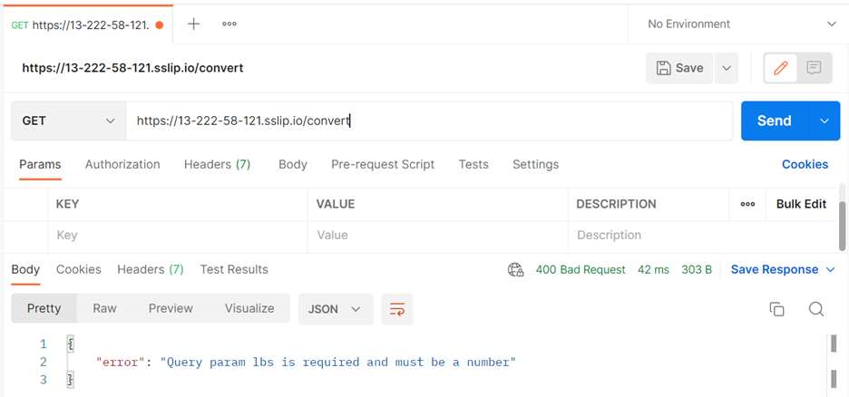

# CS554 Project 1 — EC2 REST Service: Pounds → Kilograms
---
Author: Sweekriti Gautam

A minimal REST API on AWS EC2 that converts pounds (lbs) to kilograms (kg).  

## Repo structure
- server.js – main Node.js server  
- package.json – dependencies  
- README.md – setup and usage  
- DESIGN.md – design write-up  
- screenshots/ – evidence for report  

**Public endpoints**

- **Direct app (8080):** `http://13.222.58.121:8080/convert?lbs=150`  
- **Via NGINX (80):** `http://13.222.58.121/convert?lbs=150`  
- **HTTPS (extra credit):** `https://13-222-58-121.sslip.io/convert?lbs=150`

I used the free hostname 13-222-58-121.sslip.io from sslip.io, which automatically resolves to 13.222.58.121; this met Let’s Encrypt’s hostname requirement and allowed me to issue a valid TLS certificate without purchasing a domain.

---

## API Specification

**GET** `/convert?lbs=<number>`

**200 OK** (`application/json`)
```json
{
  "lbs": 150,
  "kg": 68.039,
  "formula": "kg = lbs * 0.45359237"
}
```

**Errors**
- **400 Bad Request** — `lbs` missing or not a number (e.g., `abc`)
- **422 Unprocessable Entity** — negative or non-finite (`-5`, `NaN`, `Infinity`)

**Rounding**: `kg = round(lbs * 0.45359237, 3)` (three decimals)

---

## Setup — Install → Run → Test

### 1) Connect to EC2 (WSL method used)

```bash
mkdir -p ~/.ssh
cp /mnt/c/Users/Acer/Downloads/p1-key.pem ~/.ssh/
chmod 400 ~/.ssh/p1-key.pem
ssh -i ~/.ssh/p1-key.pem ec2-user@13.222.58.121
```

### 2) Install runtime on EC2

```bash
sudo dnf -y update
sudo dnf -y install nodejs git nginx
```

### 3) App folder + dependencies

```bash
mkdir -p ~/p1 && cd ~/p1
# Upload: .gitignore  package.json  server.js  README.md  DESIGN.md
npm install
```

### 4) Start service manually and curl-test

```bash
node server.js
# In a second SSH window:
curl -v 'http://127.0.0.1:8080/convert?lbs=150'
# Ctrl+C to stop the foreground node
```

### 5) Run as a Service (systemd)

```bash
sudo bash -c 'cat >/etc/systemd/system/p1.service <<"UNIT"
[Unit]
Description=CS554 Project 1 service
After=network.target
[Service]
User=ec2-user
WorkingDirectory=/home/ec2-user/p1
ExecStart=/usr/bin/node /home/ec2-user/p1/server.js
Environment=PORT=8080
Restart=always
[Install]
WantedBy=multi-user.target
UNIT'

sudo systemctl daemon-reload
sudo systemctl enable --now p1
sudo systemctl status p1 --no-pager
```


### Reboot verification (systemd auto-start)
Reboot the instance and confirm the service starts on boot:
```bash
sudo reboot
```
# reconnect via SSH, then:
journalctl -u p1 -b --no-pager | tail -n 80


### 6) Expose externally (did all three methods)

**A) Direct 8080**  
EC2 **Security Group → Inbound rules** → add **Custom TCP 8080** from **My IP**.
```bash
curl "http://13.222.58.121:8080/convert?lbs=150"
```

**B) NGINX on 80**

```bash
sudo bash -lc 'cat > /etc/nginx/conf.d/p1.conf << "EOF"
server {
  listen 80 default_server;
  server_name 13-222-58-121.sslip.io;
  location / {
    proxy_pass http://127.0.0.1:8080;
    proxy_set_header Host $host;
    proxy_set_header X-Forwarded-For $proxy_add_x_forwarded_for;
  }
}
EOF'

sudo nginx -t
sudo systemctl enable --now nginx
curl "http://13.222.58.121/convert?lbs=150"
```

**C) HTTPS via Let’s Encrypt**  
Open SG for **HTTP 80** and **HTTPS 443** to **Anywhere-IPv4 (0.0.0.0/0)** during issuance.
```bash
sudo dnf -y install certbot python3-certbot-nginx
sudo certbot --nginx -d 13-222-58-121.sslip.io
curl "https://13-222-58-121.sslip.io/convert?lbs=150"
```

---

## Test (curl examples)

### A) Direct (8080)
```bash
curl "http://13.222.58.121:8080/convert?lbs=150"   # 200
curl "http://13.222.58.121:8080/convert"           # 400
curl "http://13.222.58.121:8080/convert?lbs=abc"   # 400
curl "http://13.222.58.121:8080/convert?lbs=-5"    # 422
curl "http://13.222.58.121:8080/convert?lbs=0.1"   # 0.045
curl "http://13.222.58.121:8080/convert?lbs=0"     # 0.000
```

### B) Via NGINX (80)
```bash
curl "http://13.222.58.121/convert?lbs=150"   # 200
curl "http://13.222.58.121/convert"           # 400
curl "http://13.222.58.121/convert?lbs=abc"   # 400
curl "http://13.222.58.121/convert?lbs=-5"    # 422
curl "http://13.222.58.121/convert?lbs=0.1"   # 0.045
curl "http://13.222.58.121/convert?lbs=0"     # 0.000
```

### C) HTTPS
```bash
curl "https://13-222-58-121.sslip.io/convert?lbs=150"  # 200
curl "https://13-222-58-121.sslip.io/convert"           # 400
curl "https://13-222-58-121.sslip.io/convert?lbs=abc"   # 400
curl "https://13-222-58-121.sslip.io/convert?lbs=-5"    # 422
curl "https://13-222-58-121.sslip.io/convert?lbs=0.1"   # 0.045
curl "https://13-222-58-121.sslip.io/convert?lbs=0"     # 0.000
```

---

## Cleanup (Cost Hygiene)

> **Service status:** Project resources were cleaned up. Screenshots in `screenshots/` show correct behavior. The screenshots for cleanup are attached in DESIGN.md.

### What I cleaned up
- Closed inbound ports **8080/80/443** in the Security Group (SSH 22 only from my IP).
- Terminated the EC2 instance (screenshot added in design.md).
- Deleted the project **Key Pair** (screenshot added in design.md).
- Verified **no orphaned EBS volumes** remain (screenshot added in design.md).
- No Elastic IP was allocated.

---

## Screenshots

### API - with Curl
  
*Figure 1: curl request showing successful conversion (lbs=150 → kg)*  

---

### API — with port 8080
  
*Figure 2: Postman request (lbs=0 → 0.000 kg, 200 OK)*  

  
*Figure 3: Postman request (lbs=150 → 68.039 kg, 200 OK)*  

  
*Figure 4: Postman request (lbs=0.1 → 0.045 kg, 200 OK)*  

  
*Figure 5: Postman error response (missing param, 404)*  

  
*Figure 6: Postman error response (negative input, 422)*  

  
*Figure 7: Postman error response (NaN input, 400)*  

---

### API — via NGINX on port 80
  
*Figure 8: NGINX proxy request (lbs=0 → 0.000 kg, 200 OK)*  

  
*Figure 9: NGINX proxy request (lbs=150 → 68.039 kg, 200 OK)*  

  
*Figure 10: NGINX proxy request (lbs=0.1 → 0.045 kg, 200 OK)*  

  
*Figure 11: NGINX proxy error (missing param, 404)*  

  
*Figure 12: NGINX proxy error (negative input, 422)*  

  
*Figure 13: NGINX proxy error (NaN input, 400)*  

---

### API — HTTPS (sslip.io)
  
*Figure 14: HTTPS request (lbs=0 → 0.000 kg, 200 OK)*  

  
*Figure 15: HTTPS request (lbs=150 → 68.039 kg, 200 OK)*  

  
*Figure 16: HTTPS request (lbs=0.1 → 0.045 kg, 200 OK)*  

  
*Figure 17: HTTPS error (missing param, 400)*  

  
*Figure 18: HTTPS error (negative input, 422)*  

  
*Figure 19: HTTPS error (NaN input, 400)*  

---

### Service & Logs (EC2)
  
*Figure 20: systemctl showing service active (running)*  

  
*Figure 21: journalctl logs of recent requests*  

---

### AWS Console
  
*Figure 22: Security Group inbound rules before cleanup*  

  
*Figure 23: AWS EC2 instance summary*  

---

### User
  
*Figure 24: Service running under non-root ec2-user account*  


