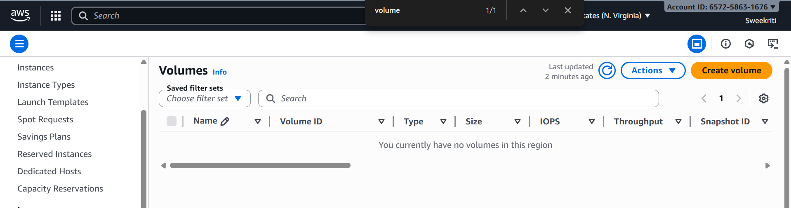

# DESIGN.md — CS554 Project 1: EC2 REST (lbs → kg)

## 1) Overview & Goals
The goal of this project was to deploy a minimal REST service on AWS EC2 that converts pounds (lbs) to kilograms (kg). The service returns JSON responses with correct rounding and validation. Additional goals included secure provisioning, reliability via service management, basic logging, and documentation. Optional enhancements included reverse proxying through NGINX and TLS termination with Let’s Encrypt.  

**Stack:** Node.js with Express and Morgan, managed by systemd; NGINX reverse proxy on port 80; optional TLS via sslip.io and Certbot.  

**Endpoints used**
- Direct app (8080): `http://13.222.58.121:8080/convert?lbs=150`  
- NGINX (80): `http://13.222.58.121/convert?lbs=150`  
- HTTPS (optional): `https://13-222-58-121.sslip.io/convert?lbs=150`  

---

## 2) Architecture
**Instance:** Amazon EC2 t2.micro (default VPC, Amazon Linux).  

**Process model**
- Application runs as `ec2-user` under **systemd** (`node server.js`).  
- Reverse proxy (optional): **NGINX** forwards requests on `:80` → `127.0.0.1:8080`.  
- TLS (optional): **Certbot** issues a certificate for `13-222-58-121.sslip.io`.  

**Security Group Rule Summary**
- SSH (22/tcp) restricted to my IP.  
- Application (8080/tcp) open for demo only.  
- HTTP (80) and HTTPS (443) open to the world for web access.  

**Data flow**
1. Client → port 8080 → Node.js service.  
2. Client → port 80 → NGINX → Node.js service.  
3. Client → port 443 (TLS) → NGINX → Node.js service.  

---

## 3) API Specification
**GET** `/convert?lbs=<number>`  

**200 OK** (JSON)  
```json
{ "lbs": 150, "kg": 68.039, "formula": "kg = lbs * 0.45359237" }
```  

**Errors**
- **400 Bad Request**: missing or invalid `lbs`.  
- **422 Unprocessable Entity**: negative or non-finite values.  

**Formula:** `kg = lbs * 0.45359237`, rounded to three decimals.  

---

## 4) Implementation
- **Node/Express:** lightweight service with `express` for routing and `morgan` for logging. Validation ensures correct status codes for invalid inputs.  
- **Logging:** requests and responses logged through `journald`, managed by the OS.  
- **Service management:** application runs as a non-root user under `systemd`, configured to restart automatically and start on boot.  
- **NGINX proxy:** forwards requests on port 80 and handles TLS termination.  
- **TLS:** `sslip.io` provided a hostname mapping the IP, enabling Let’s Encrypt to issue a certificate without a purchased domain.  

---

## 5) Security & Hygiene
- **Least privilege:** service runs as ec2-user, not root (evidence shown in screenshots).
- **Security Groups:** configured with only the essential inbound rules — SSH (22) restricted to my IP for administration, port 8080 temporarily open for demo, and HTTP (80) / HTTPS (443) open for web access during testing.
- **Logging hygiene:** system logging managed through journald with automatic rotation.  
- **Cost hygiene:** all project resources (instance, volumes, key pairs, Elastic IPs) were cleaned up after project completion (see Cleanup section for evidence).
---

## 6) Testing & Evidence
- **Local EC2 tests:** verified with curl against `127.0.0.1:8080`.  
- **External tests:** curl and Postman against the public IP confirmed both valid and error cases.  
- **Reliability:** `systemctl status p1` confirmed service was active; `journalctl` logs verified request handling.  
- **Screenshots:** included in README to document successful responses over 8080, 80, and HTTPS.  

---

## 7) Rationale
- **Node/Express**: minimal setup for a clean REST API.  
- **systemd**: ensures service resilience and reboot survival.  
- **NGINX**: provides clean port-80 access and TLS termination.  
- **sslip.io + Certbot**: enabled HTTPS without domain costs, suitable for demonstration.  

---

## 8) Cleanup Note

- Closed Security Group ports 8080, 80, and 443  
  
*Figure 25: Security Group inbound rules after cleanup (only SSH open)*  

- Terminated EC2 instance after project completion.  
  
*Figure 26: EC2 instance shown in terminated state*  

- Deleted lab Key Pair and confirmed no Elastic IP was allocated.  
  
*Figure 27: AWS Console showing deleted project Key Pair (no Elastic IPs allocated)*  

- Verified that no orphaned EBS volumes remain.  
  
*Figure 28: AWS Console confirming no remaining EBS volumes in this region*  
